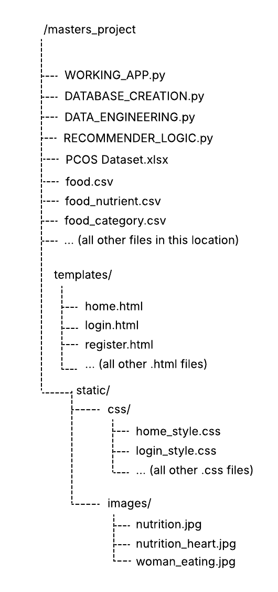

# COM7016 MSc Project Artefact: AI-Driven Personalised Nutrition Recommender for Women's Hormonal Health and Polyendocrine Metabolic Ovarian Syndrome (PMOS)

### Lily Baxendale
### Student Number: 2509923

## Project Overview
The project successfully deployed a multi-modal, AI-driven nutrition recommender web application, directly both addressing the increased need for femtech and precision nutrition. By pivoting from traditional caloric-deficit models, the final artefact combines clinical markers, menstrual data, and physical symptoms to generate a highly personalised 5-dimensional micronutrient vector. Specific clinical complaints such as inflammation and symptoms of PMOS are successfully target with literature-backed, clinically relevant dietary advice.

## Generative AI Statement
The assignment used generative AI in the following ways for the purposes of the completing the assignment: editing.
Example of prompts used: How do I safely change the names of fiber to fibre in this code file?
See screenshots of Generative AI usage in the file named Appendix 1. 

## System Functionality
My web application is a nutrition recommender system prototype intended for used for use by users seeking personalised nutrition adivce for hormonal health. 

###  Users
Users (patients) can fill in a questionnaire about their health, including details of their recorded clinical results such as fasting glucose. They can also provide their preferred diet such as 'vegetarian' by choosing from the radio button options. Food allergens for users can also be recorded with checkboxes such as 'nuts' or 'eggs'. After completing the questionnaire, users can view their top ten food recommendations, including the nutrient contents of food and tailored nutrient advice. Users can also view their personal details, edit their information, and terminate their account and data as full CRUD functionality is incorporated. 

## Technical & Security Features
The artefact incorporates secure programming techniques, security best practices, secure architecture design, and graceful degradation to ensure a robust system against potential security threats to sensitive data, and incase of the lack of clinical data from users. 

### Secure Database Architecture
A relational SQLite database is used for patient data, and nutrition data to enforce strict schema for critical login data and sensitive health data.

### Input Sanitisation & Validation 
The user registration form utilises server-side regex validation to prevent potential injection attacks and invalid or bad data entry.

### Secure Session Handling
Upon logging into the system, session cookies are enabled to track logged-in users, The session is cleared automatically upon logout to prevent unauthorized access.

### Password Encryption
All user passwords are hashed using the method pbkdf:sha256 before storage. This ensures that raw passwords are never exposed in the database.

### Parameterized Queries
For queries to the database, the '?' placeholder is used to prevent SQL injection attacks, ensuring that cyber attackers cannot manipulate database commands.

### Graceful Degradation
A significant achievement of the final system was its implementation of graceful degradation, this design approach is applied in the user questionnaire: when patients cannot provide lab results, a secondary vector applies physical symptom proxies such as acne or skin darkening acanthosis.

### Unit Testing & Edge Cases
18 unit tests were implemented across different features of the application to ensure that they are all working as intended. This includes testing recommendation logic, and testing to ensure the system is  robust against bad data entry and other potential security threats such as SQL injection. Edge cases such as a severe tree nut allergy patient profile are tested to ensure the recommendation logic adheres to specific dietary and allergen constraints. Fake user credentials were created using the Python library 'Faker'

## Application Installation Instruction & User Guide
### 1. Prerequisites
Before running the application, ensure the following software is installed along with having a stable, active internet connection:
- Python 3.x
- Jupyter Notebook

### 2. Folder Structure & File Setup 
For the application to work as intended set up the required project folder set up/hierarchy in the image below. This is so that Flask can locate the html templates and CSS files.

Note: The files .... are automatically created when the main application code in 'WORKING_APP.py' is run. However, I have also included a copy of those files in the repository to download and place in '/masters_project' folder as a safety fall back. Either methods will work.
Download the 'WORKING_APP.py', xlsx, csv files, folder, html, css, png, jpeg, and all other files from the repository to place in the folder set up.

### 3. Library Installation
There are a number of libraries used and imported in the code to make the application work.

Run this command in terminal:
```python 
pip install pandas numpy scikit-learn matplotlib seaborn werkzeug faker openpyxl matplotlib networkx
```

Or run this line of code inside the Jupyter Notebook:
```python
%pip install pandas numpy scikit-learn matplotlib seaborn werkzeug faker openpyxl matplotlib networkx
```

Ensure that you install all of the libraries included if you have not already installed them before.

### 4. Database Configuration
No set up is required, the SQLite database 'patientdb.db' is already created, however, if for any reason the database was accidentally deleted, the application code automatically generates a 'patientdb.db' and populates it with patient data and food data from the csv and xlsx files upon the first run. The 'patientdb.db' is also in the repository for download.

### 5. Running the Application
1. Navigate to the project folder and open WORKING_APP.py
2. Run the application. NOTE: It takes around 5 minutes for the code to run. Once it is fully finished running it should say that the Debugger is active in the terminal.
3. Click the link [http://127.0.0.1:5000](http://127.0.0.1:5000) to open the web application in your browser.


### 6. Testing with Existing Login Credentials 
The file 'patientdats_nohash' is a csv file containing the patient health data and generated fake user credentials (email, passwords) which can be used the test the application system. Here are some examples below that can be used:

#### Example 1
Email: maureen.burgess2@example.com
Password: 7CgWDl#2yDA0

#### Example 2
Email: jennifer.sheppard4@example.com
Password: wvCNu4AMq18n

### 7. Troubleshooting 
- Template Not Found: Ensure HTML files are strictly inside the templates/ folder and that CSS files are strictly in the css/ folder.
- SQL Database Locked: Ensure that no other notebooks or database viewer such as DB Browser is keeping ‘hospitaldata.db’ open if there are any SQLite errors. 

## Other Files in The Repository
The application was designed and prduced using the CRISP-DM lifecycle. The files detailed below were created as part of following the lifecycle.

#### Instructions to run the Jupyter Notebooks and Python 
1.  Launch Anaconda Navigator and open Jupyter Notebook if running a Jupyter Notebook. Alternatively, launch Visual Studio for Python file.
2.	Navigate to the project folder and open the specific Jupyter/Python file.
3.	Go the menu bar, select Cell, and click Run All (or just click Run All in Visual Studio).

### Exploratory Data Analysis of The PCOS Dataset: 'EDA_ONLY.ipynb'
This file cleans the data and creates boxplots and histograms to analyse the spread of the health data.

### Food Data Analysis File: 'food_analysis.ipynb'
This file cleans and analyses the filtered USDA food dataset and examine the nutrients and categories of food. 
NOTE: This file can only be run after running the 'WORKING_APP.py' file.

### Recommender Logic Development File: 'MODELLING_FILE.ipynb'
This file contains the development of several iterations of the cosine similarity recommender logic. 
NOTE: This file calls in functions from the 'EVALUATION_METRICS.py' file (contains the), so ensure this file is also downloaded and placed in the masters_project folder. 

### Unit Testing File: 'TESTING.py'
This file contains 18 units tests that test acrosss several different aspects of the application including input validation, security measures, and ensuring recommendation logic works as intended. 

### 'DATA_ENGINEERING.py', 'RECOMMENDER_LOGIC.py', 'DATABASE_CREATION.py' files
These files contain the functions intended for use in the 'WORKING_APP.py' file. 'DATA_ENGINEERING.py' processes the raw patient xlsx files, while the 'RECOMMENDER_LOGIC.py' processes the raw food csv files and contains the recommender function. 'DATABASE_CREATION.py' pulls the functions from the other two files together to run. The file structure follows a modular design for efficiency, organisation, and to seperate different concerns and application aspects.
NOTE: Only the 'WORKING_APP.py' needs to run as it calls in the functions from the aforementioned files.

### Edge Case Testing File: 'EDGE_CASES.ipynb' 
These files contain the code that tests edge case patient profiles, including preferred diets and severe allergies. 
NOTE: This file calls in functions from the 'EVALUATION_METRICS.py' file (contains the), so ensure this file is also downloaded and placed in the masters_project folder. 

### Random Forest Experimentation File: 'RF_EXPERIMENTATION.ipynb'
This file contains the code that attempts to use the machine learning algorithm Random Forest to predict the nutrient vector based on a patient's health data.

### K-Means Clustering of PMOS Phenotypes File: 'K_MEANS_EXPERIMENTATION.ipynb'
This file contains the code that attempts to use K-means clustering to group PMOS groups based on 4 Rotterdam PMOS phenotypes.

### Food Datasets: 'food.csv', 'food_category.csv', 'food_nutrient.csv', 'nutrient.csv'
These are the USDA food datasets used for the artefact. 

### PCOS Dataset: 'PCOS Dataset.xlsx'
The PCOS health data from real Phillipine female patients. 

### Appendix 1 File
This contains the screenshots of AI usage as part of the evidence for the Generative AI usage declaration.

### Clean PCOS Datasets: 'clean_pcos_data.xlsx', 'clean_pcos_data.csv'
These are the clean version of the original 'PCOS Dataset.xlsx' dataset without the fake generated login credentials. 
